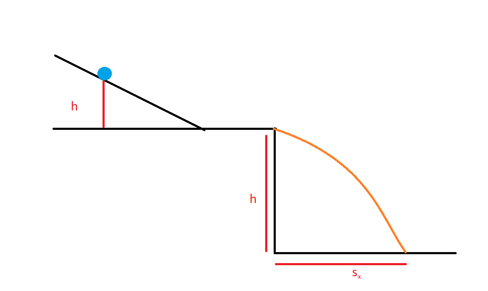

Projectile Motion
=================

.. admonition:: Syllabus Excerpt

   **Inquiry Question:** How can models that are used to explain projectile motion be used to analyse and make predictions?

   * analyse the motion of projectiles by resolving the motion into horizontal and vertical components, making the following assumptions:

     * a constant vertical acceleration due to gravity

     * zero air resistance

   * apply the modelling of projectile motion to quantitatively derive the relationships between the following variables:

     * initial velocity

     * launch angle

     * maximum height

     * time of flight

     * final velocity

     * launch height

     * horizontal range of the projectile (ACSPH099)

   * conduct a practical investigation to collect primary data in order to validate the relationships derived above.

   * solve problems, create models and make quantitative predictions by applying the equations of motion relationships for uniformly accelerated and constant rectilinear motion  

    |syllabus-nesa|_

*Projectile Motion* is motion done only under the influence of one force - the weight force.
There is only force acting in the vertical direction, and none in th ehorizontal.
This ignores any other forces that may apply, such as:

* air resistance
* the magnus effect (causing deviations from straight path)
* differring gravity at different heights in the gravitational field
* the mass is a point object

A *projectile* is a point particle which is given an initial velocity and then follows a path ("trajectory") determined by gravity.
A *trajectory* is a concave down parabola.

As the horizontal and vertical components of velocity are independent, projectile motion can be analysed using variations on the SUVAT formulas.

.. list-table::
   :width: 90%
   :align: center

   * - Linear Motion
     - Horizontal Motion
     - Vertical Motion
   * - $v = u + at$
     - $v_x = u_x$
     - $v_y = u_y + a_yt$
   * - $v^2 = u^2 + 2as$
     - $v_x^2 = u_x^2$
     - $v_y^2 = u_y^2 + 2a_ys_y$
   * - $s = ut + \frac{1}{2}at^2$
     - $s_x = u_xt$
     - $s_y = u_yt + \frac{1}{2}a_yt^2$

The maximum height of a projectile is when $v_y = 0$.

When projectiles are fired *horizontally* from a height, the maximum height will be at $t=0s$ and $u_y=0$.

Projectiles fired at an angle upwrads from the ground, will have a maximum height at $t_{\frac{1}{2}}$ when $v_y=0$.
The trajectory is symmetrical and hence $u_y = - v_y$.

Projectiles fired at an angle from a height, will have a maximum height when $v_y=0$ at a time **not** equal to $t_{\frac{1}{2}}$.

.. hint::

   The best way to learn these concepts are through examples.
   Jacaranda Physics Year 12 as well as Surfing NSW Physics both cover
   worked problems of all three types of projectile trajectory.
   Pearson Physics and Physics in Focus cover only symmetrical and horizontal at a height.
   There are also various questions in the Physics sample problems from NESA and in the past HSCs.

   Do questions, and mark your solutions.
   **Do them again if you get it wrong.**

Deriving the Best Angle for Maximum Range
-----------------------------------------

Given an initial velocity $u$ at angle of $\theta$ from the horizontal, we can calculate the range.

We can calculate the horizontal velocity as $u_x = \left|u\right|\cos\theta $, and the range is $s_x = u_xt = \left|u\right|\cos\theta t$.
To find $t$, we can calculate the time to reach the peak of motion:

.. math::

   \begin{align*}
      v_y &= u_y + a_yt \\
      0   &= |u|\sin\theta -gt_{\text{peak}} \\
      t_{\text{peak}} &= \frac{|u|sin\theta}{g}
   \end{align*}

As the trajectory is symmetric $t = 2t_{\text{peak}}$.

Hence, we can sub this into the range equation, and use the double-angle formula.

.. math::

   \begin{align*}
      s_x &= \frac{\left|u^2\right| 2\cos\theta\sin\theta}{g} \\
          &= \frac{\left|u^2\right| \sin2\theta}{g}
   \end{align*}

The maximum value of $\sin\alpha$ occurs at $\alpha = \pi$, and thus the max value of $\sin2\theta$ occurs when $\theta = \frac{\pi}{2}$, or at 45 degrees.
Hence, the maximum value of $s_x$ occurs at 45 degrees to the horizontal.

Practical Investigation: Projectile Motion
------------------------------------------

1. Set up a linear ramp on the edge of a table as below. Place carbon paper on top of a piece of white paper in the approximate range of where the projectile will land, alongside a ruler measured from $s_x = 0$

2. Measure the height above the table using a ruler ($h$)
3. Place the ball at a height of 10cm above the table on the ramp.
4. Release the ball, and measure the position of the dot left by the carbon paper from the edge of the table ($s_x$). Repeat 4 more times
5. Repeat Steps 3 and 4 at 20cm and 30cm above the table.
6. Record the data in a table like so:

   .. list-table::
      :width: 60%
      :align: center

      * - Height (m)
        - Run 1 (m)
        - Run 2 (m)
        - Run 3 (m)
        - Run 4 (m)
        - Run 5 (m)
        - Average (m)
      * - 0.100
        -
        -
        -
        -
        -
        -
      * - 0.200
        -
        -
        -
        -
        -
        -
      * - 0.300
        -
        -
        -
        -
        -
        -

7. The horizontal launch velocity can be calculated using a combination of $\Delta U = mg\Delta h$, $KE=\frac{1}{2}mv^2$ and $\Delta KE = -\Delta U$.
From there, the estimated $s_x$ can be calculated and compared to the measured values.

.. admonition:: Other Resources

   * `Rochester Institute of Technology, PHYS311 <http://spiff.rit.edu/classes/phys311/workshops/w3a/proj.html>`_
   * `The Physics Classroom - Projectile Motion <https://www.physicsclassroom.com/class/vectors/Lesson-2/What-is-a-Projectile>`_
   * `PHET Simulation - Projectile Motion <https://phet.colorado.edu/en/simulation/projectile-motion>`_

.. admonition:: HSC Questions

   Multiple Choice:

      * 2002, Q1
      * 2004, Q1
      * 2005, Q1
      * 2007, Q5
      * 2008, Q3
      * 2009, Q4
      * 2010, Q2
      * 2010, Q4
      * 2011, Q15
      * 2013, Q6
      * 2014, Q20
      * 2015, Q4
      * 2016, Q17
      * 2018, Q19
      * 2019, Q1
      * 2020, Q5
      * 2020, Q15

   Short Answer:

      * 2004, Q16
      * 2006, Q16
      * 2007, Q16
      * 2010, Q22
      * 2012, Q27
      * 2014, Q30
      * 2015, Q21
      * 2017, Q29
      * 2018, Q27
      * 2019, Q30
      * 2020, Q24
